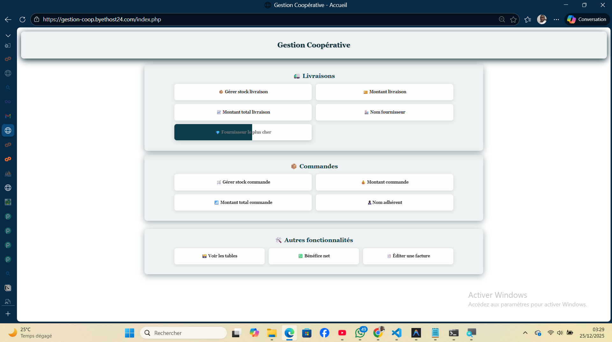
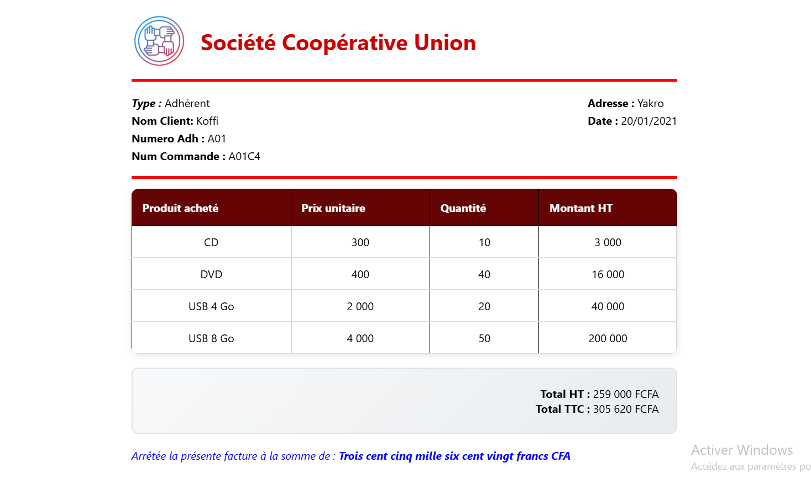
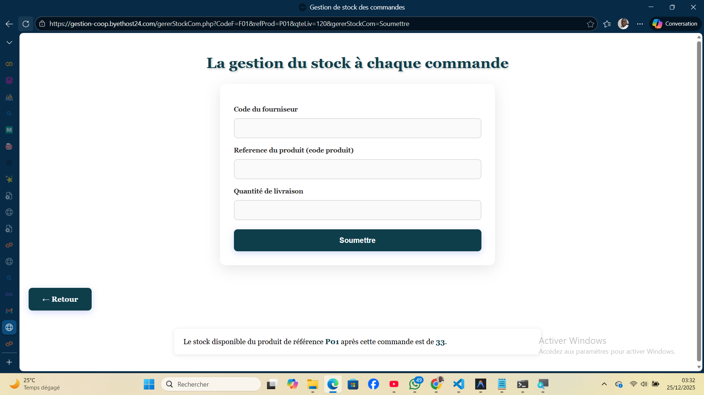

# 🏢 Système de Gestion de Coopérative


Un système complet de gestion pour coopératives permettant la gestion des adhérents, fournisseurs, produits, commandes et livraisons avec génération automatique de factures.

## 📋 Table des Matières

- [Aperçu](#aperçu)
- [Fonctionnalités](#fonctionnalités)
- [Structure du Projet](#structure-du-projet)
- [Prérequis](#prérequis)
- [Installation](#installation)
- [Configuration](#configuration)
- [Utilisation](#utilisation)
- [API/Fonctions](#api-fonctions)
- [Base de Données](#base-de-données)
- [Captures d'Écran](#captures-décran)
- [Déploiement](#déploiement)
- [Contribution](#contribution)
- [Auteurs](#auteurs)
- [Licence](#licence)

## 🎯 Aperçu

Ce projet a été développé dans le cadre du **Projet 3 : Gestion d'une Coopérative** - Formation Data Analyst Industriel 2025-2026. Il permet de gérer efficacement les opérations d'une coopérative commerciale.

### Démo en Ligne
🌐 [Voir la démo](https://gestion-coop.byethost24.com/index.php)

## ✨ Fonctionnalités

### Gestion des Entités
- ✅ Gestion des adhérents (CRUD)
- ✅ Gestion des fournisseurs (CRUD)
- ✅ Gestion des produits (CRUD)
- ✅ Suivi des commandes et livraisons

### Opérations Métier
- 📊 Calcul des montants (commandes, livraisons)
- 💰 Calcul du bénéfice global
- 📦 Gestion automatique des stocks
- 🔍 Recherche du fournisseur le plus cher par produit

### Facturation
- 🧾 Génération automatique de factures (adhérents/fournisseurs)
- 🔢 Numérotation automatique des commandes
- 📝 Conversion du montant en lettres
- 🖨️ Impression des factures
- 💶 Calcul automatique TVA (18%)

### Interface
- 🎨 Interface web moderne et responsive
- 📱 Compatible mobile/tablette/desktop
- 🎯 Navigation intuitive
- ⚡ Performances optimisées

## 📁 Structure du Projet

```
gestion-cooperative/
│
├── index.php                      # Page d'accueil avec menu et facturation
├── connexion_to_DB.php           # Configuration connexion MySQL
├── close_DB.php                  # Fermeture connexion DB
├── fonctions.php                 # Toutes les fonctions métier
│
├── pages/
│   ├── afficherTable.php         # Affichage du contenu des tables
│   ├── benefice.php              # Calcul bénéfice global
│   ├── facture.php               # Affichage & impression de facture des clients et fournisseurs
│   ├── gererStockCom.php         # Gestion stock commandes
│   ├── gererStockLiv.php         # Gestion stock livraisons
│   ├── montantCom.php            # Calcul montant commande
│   ├── montantLiv.php            # Calcul montant livraison
│   ├── montantTotalCom.php       # Montant total commandes
│   ├── montantTotalLiv.php       # Montant total livraisons
│   ├── nomAdherent.php           # Recherche nom adhérent
│   ├── nomFournisseur.php        # Recherche nom fournisseur
│   └── nomFourCher.php           # Fournisseur le plus cher
│
├── assets/
│   ├── css/
│   │   └── styles.css            # Styles CSS
│   ├── js/
│   │   └── script.js             # Scripts JavaScript
│   └── images/
│       └── logo.png              # Logo entreprise
│
├── sql/
│   ├── schema.sql                # Schéma de la base de données
│   ├── data.sql                  # Données de test
│   └── constraints.sql           # Contraintes d'intégrité
│
├── docs/
│   ├── rapport.pdf               # Rapport du projet
│   └── manuel_utilisateur.pdf   # Manuel d'utilisation
│
├── .gitignore                    # Fichiers à ignorer par Git
├── README.md                     # Ce fichier
└── LICENSE                       # Licence du projet
```

## 🔧 Prérequis

- PHP 7.4 ou supérieur
- MySQL 5.7 ou supérieur
- Serveur web (Apache/Nginx)
- Extension PHP : PDO_MySQL

### Environnement de Développement Recommandé
- XAMPP / WAMP / MAMP
- VS Code avec extensions PHP
- Git

## 🚀 Installation

### 1. Cloner le Projet

```bash
# Clone via HTTPS
git clone https://github.com/Adjoum/DataAnalytic_projet3_DB_gestion-cooperative.git

# Ou via SSH
git clone git@github.com/Adjoum/DataAnalytic_projet3_DB_gestion-cooperative.git

# Naviguer dans le dossier
cd DataAnalytic_projet3_DB_gestion-cooperative
```

### 2. Créer la Base de Données

```bash
# Se connecter à MySQL
mysql -u root -p

# Créer la base de données
CREATE DATABASE gestion_cooperative CHARACTER SET utf8 COLLATE utf8_general_ci;
USE gestion_cooperative;

# Importer le schéma
source sql/schema.sql;

# Importer les données
source sql/data.sql;

# Importer les contraintes
source sql/constraints.sql;
```

### 3. Configuration

Modifier le fichier `connexion_to_DB.php` :

```php
<?php
$DB_Name = 'gestion_cooperative';
$DB_Password = 'votre_mot_de_passe';  // Modifier ici
$User_Name = 'root';                   // Modifier si nécessaire
$ServerName = 'localhost';
?>
```

### 4. Lancer le Projet

```bash
# Démarrer Apache et MySQL (XAMPP)
# Accéder à : http://localhost/gestion-cooperative/
```

## ⚙️ Configuration

### Variables d'Environnement

Pour plus de sécurité, créez un fichier `.env` :

```env
DB_HOST=localhost
DB_NAME=gestion_cooperative
DB_USER=root
DB_PASSWORD=votre_password
DB_CHARSET=utf8
```

### Configuration Serveur

Dans `php.ini`, assurez-vous que :
```ini
extension=pdo_mysql
date.timezone = Africa/Abidjan
```

## 💻 Utilisation

### Afficher les Tables

1. Cliquez sur "📊 Voir les tables"
2. Entrez le nom de la table (adherents, produits, etc.)
3. Validez pour afficher le contenu

### Éditer une Facture

1. Cliquez sur "🧾 Éditer une facture"
2. Entrez le code (A01 pour adhérent, F01 pour fournisseur)
3. Sélectionnez la date
4. Cliquez sur "Éditer la facture"
5. Imprimez avec le bouton "🖨️ Imprimer"

### Gérer les Stocks

1. Accédez à "📦 Gérer stock commande" ou "🚚 Gérer stock livraison"
2. Remplissez les informations requises
3. Validez pour voir le stock disponible

## 🔌 API/Fonctions

### Fonctions Fournisseurs

```php
// Nom du fournisseur
nomFournisseur($codeF);

// Montant d'une livraison
montantLiv($codeF, $refPr, $dateLiv);

// Montant total livraisons
montantTotalLiv($codeF, $dateLiv);

// Fournisseur le plus cher
nomFourCher($refPr);
```

### Fonctions Adhérents

```php
// Nom de l'adhérent
nomAdherent($codeAdh);

// Montant d'une commande
montantCom($codeAdh, $refPr, $dateCom);

// Montant total commandes
montantTotalCom($codeAdh, $dateCom);
```

### Fonctions de Gestion

```php
// Calcul du bénéfice
benefice();

// Gestion stock livraison
gererStockLiv($codeF, $refPr, $qteLiv);

// Gestion stock commande
gererStockCom($codeF, $refPr, $qteLiv);
```

### Fonctions de Facturation

```php
// Facture adhérent
factureAdh($codeAdh, $date);

// Facture fournisseur
factureFour($codeF, $date);

// Générer numéro commande
genererNumeroCommande($code, $date);
```

## 🗄️ Base de Données

### Schéma E/R

```
ADHERENTS ──┐
            │
            ├─► COMMANDER ◄─┬─► PRODUITS ◄─┬─► DETAILSLIV ◄─┐
            │               │               │                 │
            └─► DATES ◄─────┘               └─► DATES ◄──────┴─► FOURNISSEURS
```

### Tables Principales

| Table | Description | Clé Primaire |
|-------|-------------|--------------|
| `adherents` | Informations adhérents | numAdh |
| `fournisseurs` | Informations fournisseurs | codeFour |
| `produits` | Catalogue produits | refProd |
| `commander` | Commandes adhérents | numAdh, refProd, dateCom |
| `detailsliv` | Livraisons fournisseurs | codeFour, refProd, dateLiv |
| `dates` | Dates de référence | date |

## 📸 Captures d'Écran

### Page d'Accueil


### Édition Facture


### Gestion Stocks


## 🌐 Déploiement

### Déploiement sur InfinityFree

Voir le guide détaillé dans [DEPLOYMENT.md](docs/rapport.md)

**Étapes rapides :**
1. Créer compte sur infinityfree.com ou  byethost24.com
2. Créer base de données MySQL
3. Télécharger fichiers via FTP
4. Importer SQL via phpMyAdmin
5. Configurer connexion_to_DB.php

### Déploiement sur Autres Hébergeurs

Le projet est compatible avec :
- Hostinger
- 000webhost
- Heroku (avec ClearDB MySQL)
- DigitalOcean
- AWS EC2

## 🤝 Contribution

Les contributions sont les bienvenues !

1. Fork le projet
2. Créez votre branche (`git checkout -b feature/AmazingFeature`)
3. Committez vos changements (`git commit -m 'Add some AmazingFeature'`)
4. Push vers la branche (`git push origin feature/AmazingFeature`)
5. Ouvrez une Pull Request

### Guidelines

- Respecter les standards PSR-12 pour PHP
- Commenter le code en français
- Tester avant de soumettre
- Mettre à jour la documentation

## 👥 Auteurs

- **ADJOUMANI Koffi Wilfried** - *Développeur Principal* - [Visitezmon github](https://github.com/Adjoum)
- **TOURE Awa** - *Interface web* - [@membre2](https://github.com/membre2)
- **DJATCHI Gnahoua Junior** - *Base de données* - [@membre3](https://github.com/membre3)
- **GUEI Jean Michel** - *Tests* - [@membre4](https://github.com/membre4)
- **SAVANE Syndou** - *Documentation-rapport* - [@membre5](https://github.com/membre5)


## 📄 Licence

Ce projet est sous licence MIT - voir le fichier [LICENSE](LICENSE) pour plus de détails.

## 🙏 Remerciements

- **K. M. BROU** - Encadreur du projet
- Formation Data Analyst Industriel INP-HB de Côte d'Ivoire UCA de Dakar Université Clermont Ferrand de France
- Communauté PHP 
- Stack Overflow
- Claude AI & ChatGPT

## 📞 Contact

Pour toute question ou suggestion :

- 📧 Email : adjoumanideveloppeurwebmob@gmail.com
-  LinkedIn : [Vosite mon profile LinkdIn](https://www.linkedin.com/in/koffi-wilfried-adjoumani/)
-  Meta : [Visite ma page Facebook ici](https://web.facebook.com/profile.php?id=100084939496635)

---

<div align="center">

**⭐ N'oubliez pas de mettre une étoile si ce projet vous a aidé ! ⭐**

By Adjoumani

</div>